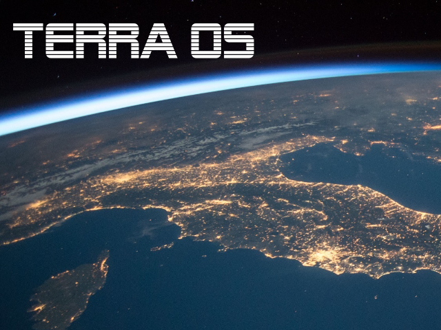

# Terra OS



Modern, minimal operating system (we've heard that before) optimized for containers within the Stellar Project.

Terra is an OS not a distro, we use the best distribution for the job, and that's an Ubuntu base.

This repo is a mono repo for most, if not all terra && stellar projects.

## Status

**Project Status:** alpha

* alpha - APIs will change, not ready services.
* beta - APIs may change, can run services.
* production - APIs stable, can run services.


## Build Terra

If you don't have a kernel built then do so first:

```bash
> make kernel
```

Now build the terra base images and components:

```bash
> make release
```

To make the terra binaries locally and install them do:

```bash
> make local && sudo make install
```

## Installation

### PXE

For running in a PXE environment terra has a controller with `tftp` and `iscsi` support.

To install the files for PXE run:

```bash
> sudo terra -r registry.compute:5000 --http pxe install
```

To save your node image in pxe run:

```bash
> terra pxe save server.toml
```

This will generate the pxe config for the node's information.

### Disk

Make sure you have a disk partitioned with one partition when installing terra.
You need to have this done before using the terra command to install the image to the device.
Use `fdisk` here to do so.

To install your image onto a disk, run the following.

To install onto an iscsi volume:

```bash
> sudo terra -r registry.compute:5000 --http  install --os /dev/sdb1
```

If you have a separate data LUN use `--data <device>` for it.

You will need to save the nodes PXE config with the `save` config.

## Boot

Now boot your node and PXE will take care of the rest.

## License

```
Copyright (c) 2019 Stellar Project

Permission is hereby granted, free of charge, to any person
obtaining a copy of this software and associated documentation
files (the "Software"), to deal in the Software without
restriction, including without limitation the rights to use, copy,
modify, merge, publish, distribute, sublicense, and/or sell copies
of the Software, and to permit persons to whom the Software is
furnished to do so, subject to the following conditions:

The above copyright notice and this permission notice shall be
included in all copies or substantial portions of the Software.

THE SOFTWARE IS PROVIDED "AS IS", WITHOUT WARRANTY OF ANY KIND,
EXPRESS OR IMPLIED,
INCLUDING BUT NOT LIMITED TO THE WARRANTIES OF MERCHANTABILITY,
FITNESS FOR A PARTICULAR PURPOSE AND NONINFRINGEMENT.
IN NO EVENT SHALL THE AUTHORS OR COPYRIGHT
HOLDERS BE LIABLE FOR ANY CLAIM,
DAMAGES OR OTHER LIABILITY,
WHETHER IN AN ACTION OF CONTRACT,
TORT OR OTHERWISE,
ARISING FROM, OUT OF OR IN CONNECTION WITH
THE SOFTWARE OR THE USE OR OTHER DEALINGS IN THE SOFTWARE.
```
